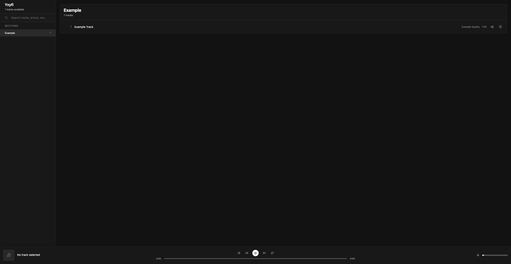

# Tracker App

A web-based music player and downloader.



## Features

- **Web Player**: Clean interface to browse and play tracks by era
- **Auto-Download**: Tracks are downloaded on-demand when played and cached locally
- **Bulk Download**: Download all available tracks at once
- **Auto-Refresh**: Automatically syncs with the tracker spreadsheet (configurable interval)
- **Album Art**: Extracts and displays embedded album artwork
- **Authentication**: Optional password protection for the web interface
- **Docker Support**: Easy deployment with Docker/Podman

## Quick Start

### 1. Clone and Configure

```bash
git clone https://github.com/nikeslides/tracker-app.git
cd tracker-app

# Create config file from example
cp config.example.toml config.toml
```

Edit `config.toml` with your settings:

```toml
output_path = "./data"
sheet_link = "https://docs.google.com/spreadsheets/d/<sheet_id>/htmlview"
refresh_interval = 3600  # seconds (1 hour)
```

### 2. Install Dependencies

```bash
python3 -m venv .venv
source .venv/bin/activate
pip install -r requirements.txt
```

### 3. Download Sheet Data

```bash
python main.py
```

### 4. Run the Player

```bash
python player.py
```

Open http://localhost:5000 in your browser.

## Usage

### Main Scripts

| Script | Description |
|--------|-------------|
| `main.py` | Downloads and processes the tracker spreadsheet |
| `player.py` | Runs the web player server |
| `download_all.py` | Bulk downloads all available tracks |

### Command Line Options

**main.py**
```bash
python main.py                 # Download sheet and process
python main.py --skip-download # Use existing CSV (skip download)
python main.py --verbose       # Show detailed column statistics
```

### API Endpoints

| Endpoint | Method | Description |
|----------|--------|-------------|
| `/api/tracks` | GET | List all available tracks |
| `/api/sections` | GET | List era sections |
| `/api/play/<track_id>` | GET | Stream/download a track |
| `/api/artwork/<track_id>` | GET | Get album artwork |
| `/api/refresh` | POST | Manually trigger sheet refresh |
| `/api/status` | GET | Server status and last refresh time |

## Configuration

### config.toml

| Option | Description | Default |
|--------|-------------|---------|
| `output_path` | Directory for data and audio files | `./data` |
| `sheet_link` | Google Sheets tracker URL | - |
| `refresh_interval` | Auto-refresh interval in seconds | `3600` |

### Environment Variables

Environment variables override config file values:

| Variable | Description |
|----------|-------------|
| `OUTPUT_PATH` | Data directory path |
| `SHEET_LINK` | Spreadsheet URL |
| `REFRESH_INTERVAL` | Refresh interval (seconds) |
| `APP_USERNAME` | Web UI username (optional) |
| `APP_PASSWORD` | Web UI password (optional) |
| `FLASK_SECRET_KEY` | Session secret key |

## Docker Deployment

### Build

```bash
# Using Podman
podman build -t tracker-app .

# Using Docker
docker build -t tracker-app .
```

### Run

```bash
podman run -d \
  --name tracker \
  -p 5000:5000 \
  -v ./data:/app/data:Z \
  -e APP_USERNAME=myuser \
  -e APP_PASSWORD=mypassword \
  tracker-app
```

## Project Structure

```
tracker-app/
├── config.toml          # Your configuration (gitignored)
├── config.example.toml  # Example configuration
├── config.py            # Config loader module
├── main.py              # Sheet downloader/processor
├── player.py            # Web player server
├── download_all.py      # Bulk track downloader
├── entrypoint.sh        # Docker entrypoint
├── Containerfile        # Docker/Podman build file
├── requirements.txt     # Python dependencies
├── static/
│   ├── css/style.css
│   └── js/player.js
├── templates/
│   ├── index.html
│   └── login.html
└── data/                # Generated data (gitignored)
    ├── sheet.csv
    ├── sheet.json
    ├── audio/           # Downloaded audio files
    └── artwork/         # Extracted album art
```

## Requirements

- Python 3.11+
- Flask
- mutagen (for audio metadata)
- Pillow (for artwork processing)

## Disclaimer

For personal use only. This tool provides an interface to external content sources. The audio files accessed through this tool are not owned by the repository author.
